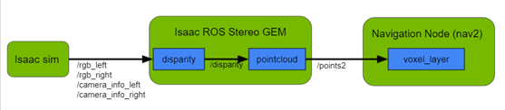
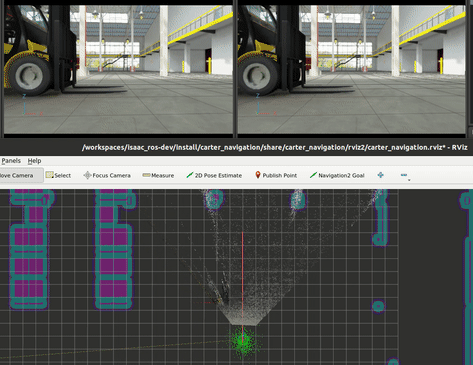
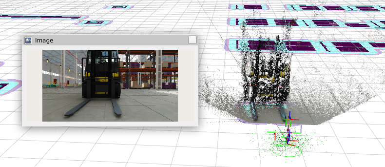
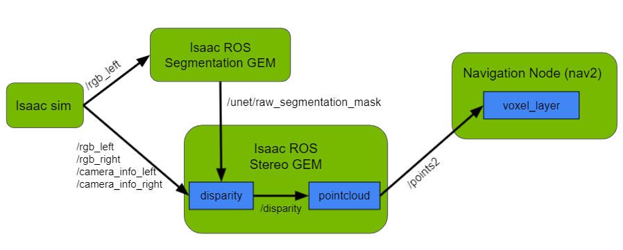
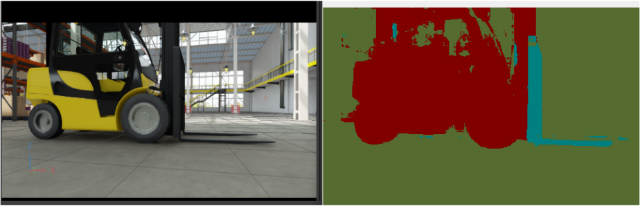

# Nav2-with-Isaac-ROS-GEMs

Through this project, we show how [NVIDIA Isaac Sim](https://developer.nvidia.com/isaac-sim) and [Isaac ROS GEMs](https://developer.nvidia.com/isaac-ros-gems) can be used with the [Nav2 navigation stack](https://navigation.ros.org/) for robotic navigation.

<p align="center" width="100%">

</p>

We focus on a real-world problem where robots are damaged due to collision with forklift tines in warehouses. This is because robot sensors (lidar) can detect the body of a forklift, but not the forks which are very close to the ground. There is a need to use other sensors in this scenario that can detect the forks. In this project, we use two RGB cameras on the robot, from which disparity is calculated using the [Isaac ROS Stereo GEM](https://github.com/NVIDIA-ISAAC-ROS/isaac_ros_image_pipeline).

<p align="center" width="100%">

</p>

## Isaac Sim Setup
We use a warehouse environment in Isaac sim which includes the Carter robot. Following the [Carter ROS2 example](https://docs.omniverse.nvidia.com/app_isaacsim/app_isaacsim/tutorial_ros2_navigation.html), we generate an occupancy map that is used by the Nav2 stack to avoid static obstacles like shelves. Dynamic/moving obstacles including forklifts and trolleys are added to the environment after creating the occupancy map.

It is important to note the offset between Carter's left and right stereo cameras in Isaac Sim for the Isaac ROS Stereo GEM to generate disparity correctly. Ensure that the [ROS2 bridge](https://docs.omniverse.nvidia.com/app_isaacsim/app_isaacsim/ext_omni_isaac_ros_bridge.html) is enabled in Sim before starting simulation.

## Isaac ROS Stereo GEM and Nav2 
Nav2 uses [global and local costmaps](https://navigation.ros.org/concepts/index.html#environmental-representation) to steer the robot clear of obstacles. The local costmap is updated based on new, moving obstacles in the environment and can take laserscans and pointclouds as input from sensors. Since laserscan from lidar fails to pick up forklift tines in real scenarios, we address this problem by using pointclouds from stereo images which are passed to Nav2. The pointcloud is generated using the Isaac ROS Stereo GEM.

<p align="center" width="100%">

</p>

The Stereo GEM generates a disparity image and then a pointcloud for all obstacles that are seen in the left and right images from the robot's cameras. Using the Isaac ROS Segmentation GEM, this disparity can be filtered to generate a pointcloud that includes only points belonging to objects of interest, for instance, forklift tines.

## Requirements

Ubuntu 20.04

ROS2 Foxy

[Isaac Sim](https://docs.nvidia.com/isaac/isaac/doc/setup.html)

[Nav2 packages](https://navigation.ros.org/getting_started/index.html)

## Running the pipeline

Create a directory `workspaces` as outlined in the [Isaac ROS Common project](https://github.com/NVIDIA-ISAAC-ROS/isaac_ros_common). Inside `workspaces`, create an `src` folder and clone the following Isaac ROS GEMs there:

[Isaac ROS Image pipeline](https://github.com/NVIDIA-ISAAC-ROS/isaac_ros_image_pipeline)

[Isaac ROS DNN Inference](https://github.com/NVIDIA-ISAAC-ROS/isaac_ros_dnn_inference)

[Isaac ROS Image Segmentation](https://github.com/NVIDIA-ISAAC-ROS/isaac_ros_image_segmentation)

Copy the following packages from the `ros2_samples` folder in the Isaac installation directory to `src`:

carter_navigation

carter_description

The directory structure should look like this:

```python
.
+- workspaces
   +- src
      +- isaac_ros_common
      +- isaac_ros_image_pipeline
      +- isaac_ros_dnn_inference
      +- isaac_ros_image_segmentation
      +- carter_navigation
      +- carter_description
```

1. Before starting Isaac Sim, [set the `ROS Domain ID`](https://docs.ros.org/en/foxy/Concepts/About-Domain-ID.html). For instance: `export ROS_DOMAIN_ID=5`. Then, open the warehouse environment in Isaac Sim and start playing the simulation. 

2. Using packages in a new terminal:
   * In a terminal, start the [isaac-ros_dev container](https://github.com/NVIDIA-ISAAC-ROS/isaac_ros_common#docker-scripts).
   * Once inside the container, set the ROS Domain ID to the same number as that used by Isaac Sim. This allows communication of ROS2 messages between processes running inside and outside the container. 
   * From the `workspaces` directory, build the ROS packages: `colcon build`. Do this everytime a change is made to the packages.
   * Source the installation: `source install/setup.bash`. Do this before running the nodes.

3. The Stereo node takes the following ROS2 topics as input, so ensure that they are enabled and publishing from Isaac Sim: `/rgb_left, /rgb_right, /camera_info_left, /camera_info_right`. Copy `isaac_ros_stereo_image_pipeline_isaac_sim_launch.py` from this repository to `/workspaces/src/isaac_ros_image_pipeline/isaac_ros_stereo_image_proc/launch`.

   In a new terminal, follow Step 2 above. Run the Stereo node in this terminal:
   `ros2 launch isaac_ros_stereo_image_proc isaac_ros_stereo_image_pipeline_isaac_sim_launch.py`.

   It publishes the disparity to `/disparity` and the pointcloud to `/points2`.

4. The Carter navigation node takes `/scan` from Isaac Sim and `/points2` from the Stereo node as input, so check that both topics are publishing data. Ensure that the pointcloud in the Carter navigation params file subscribes to `/points2`. For this, you can refer to the `carter_navigation_params.yaml` included in this repository to update the file located at `/workspaces/src/carter_navigation/params`. 

   In another terminal, follow Step 2 above. Run the Carter navigation node in this terminal:
   `ros2 launch carter_navigation carter_navigation.launch.py`.

   After running this node, an Rviz2 window will open where you can localize the robot and set a destination point.

To see the Stereo node in action, you can set a destination point such that the forklift tines are in the path of motion of the robot. Without the Stereo node running, the robot will collide with the tines. When the Stereo node is running, Nav2 will update its local costmap based on the pointcloud from the Stereo node and you will see the robot going around the tines.

## Disparity filtering 
Each pixel in the raw segmentation image generated from the Segmentation GEM represents the class label for the object at that location in the image. Knowing the label of interest, (for instance, if 15 represents forklift-tines) we set the non-interest points to `invalid` in the corresponding disparity image generated by the Stereo GEM. The pointcloud generated as a result will not include these points. This is helpful to reduce noise in the pointcloud.

<p align="center" width="100%">

</p>

1. We have used the `isaac_ros_unet` package for segmentation inference. For this project, a unet model was trained on images containing forklifts (we do not provide the model in this repository). To avoid other types of obstacles during navigation, you can train a model for your use case and use it with the pipeline explained in this project. 
2. Specify where your trained model is located in `model_file_path` in `isaac_ros_image_segmentation/isaac_ros_unet/launch/isaac_ros_unet_tensor_rt.launch.py`.
3. Apply the `disparity_node.patch` patch file: 

   Copy `disparity_node.patch` file provided in this repo to `isaac_ros_image_pipeline/isaac_ros_stereo_image_proc/src/`. It is a modification to filter disparity based on segmentation mask. Once copied, run the following command:

   `patch -p0 disparity_node.cpp disparity_node.patch`.

4. Change the `desired_label` variable to your label of interest in `disparity_node.cpp` (for instance, set it to 2 if 2 is the segmentation label for forklift-tines and you only want to generate a point cloud for forklift-tines). 
5. The unet node takes `/rgb_left` as input from Isaac Sim and performs segmentation inference using the trained model. Refer to the `isaac_ros_unet_tensor_rt.launch.py` file provided in this repository to ensure that the remappings are correct and to perform resizing of input images if required. 

   The input RGB images to the Segmentation and Stereo nodes must have the same dimensions as that of the images the segmentation model has been trained on. The generated semantic and disparity images will then be of the same size, using which filtering can be performed on the disparity image.

6. In a new terminal, follow Step 2 from [Running the pipeline](https://github.com/NVIDIA-AI-IOT/Nav2-with-Isaac-ROS-GEMs#running-the-pipeline) to build and source the packages. Run the Segmentation node in this terminal:
   `ros2 launch isaac_ros_unet isaac_ros_unet_tensor_rt_launch.py`.

   You can visualize the output using **rqt** on topic `/unet/colored_segmentation_mask` when the node is running (ensure that the `ROS_DOMAIN_ID` variable of all terminals is set to the same number).

   <p align="center" width="100%">
   
   </p>

   It publishes the raw segmentation image to `/unet/raw_segmentation_mask`, which we use to filter disparity.

 
